# AGENT REFERENCE — this harness

Operating manual for an agent working inside a repo that has this harness installed,
or installing it. Companion (rationale, prose): `HOW-TO-USE.human.md`.

Read §0 and §1 before acting. §2–§4 are lookup. §5–§9 are procedures with VERIFY
conditions — do not proceed past a failed VERIFY; report and stop.

---

## 0. DECISION TREE — what to do with a request

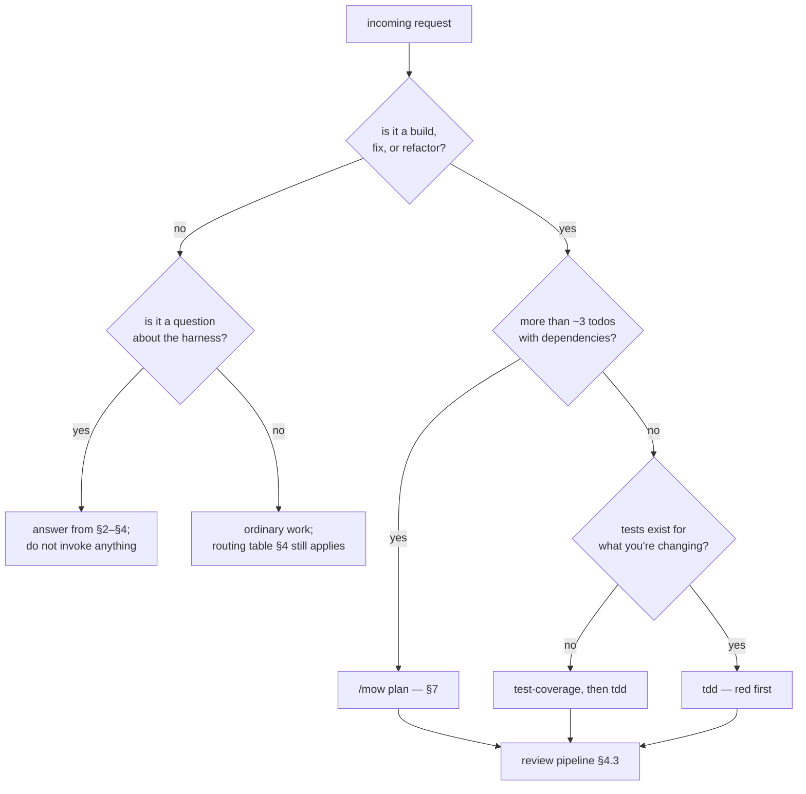

**Never skip the red step.** A test that has never failed proves nothing.

---

## 1. INVARIANTS

Violating any of these corrupts state or silently voids a guarantee.

| # | Invariant | Consequence if broken |
|---|---|---|
| I1 | Reviewers review; they never build | The gate approves its own work |
| I2 | `tdd-builder` never commits | Unreviewed code reaches history |
| I3 | Lanes in one wave own **disjoint file sets** | Parallel agents overwrite each other |
| I4 | taskman needs `.taskman.toml` in cwd or an ancestor | It stops rather than guess — this is correct, do not work around it |
| I5 | `task set -t` **replaces** the tag list | Silent tag loss; `task show` first |
| I6 | A decision task must not carry a dispatch-brief `source_ref` | End-of-run sweep marks it `done`, claiming an unanswered question was answered |
| I7 | Only a `done` blocker clears `recommend next` | A task blocked by a `disabled` decision is hidden permanently |
| I8 | Hook registration lives only in `hooks.def.json` | Two registrations = everything runs twice |
| I9 | `disabled` ≠ `done` | `done` on work that never happened is unrecoverable misinformation |
| I10 | taskman requires Postgres (`ARRAY`, `JSONB`) | Never propose SQLite |

---

## 2. MECHANISM SELECTION

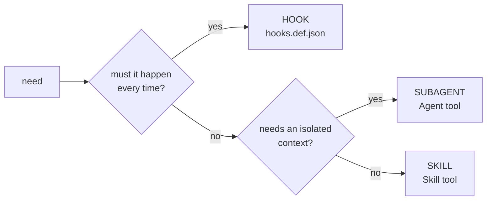

| Mechanism | Context | Cost | Fires |
|---|---|---|---|
| Skill | the calling agent's own | ~free | when relevant |
| Subagent | fresh, isolated, own tools | full spin-up | on explicit call |
| Hook | none (shell) | negligible | on lifecycle event |

Do not spawn a subagent where a skill suffices.

---

## 3. DELIVERY CHAIN — for diagnosing "X is missing"

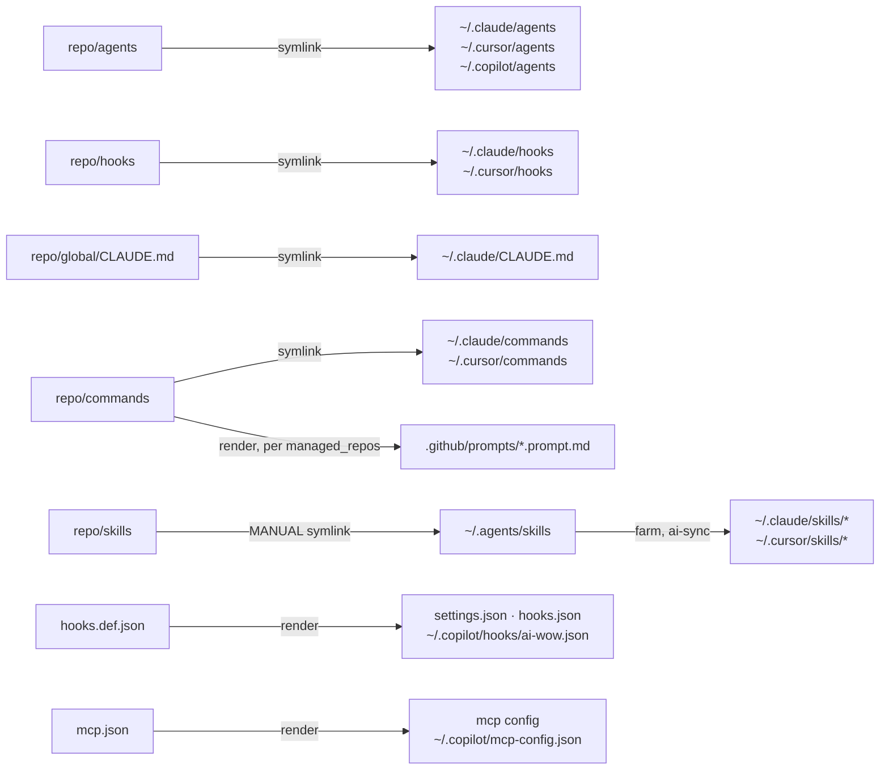

Copilot reads `~/.agents/skills` directly, so skills need no per-tool render for it.
Slash commands and workspace hooks are repo-scoped in Copilot, so they render into each
`managed_repos` entry rather than a global path.

**Diagnosis table.** Match the symptom, do not guess:

| Symptom | Root cause | Action |
|---|---|---|
| 0 skills, no error emitted | `~/.agents/skills` absent — `reconcile_skills()` returns early | Create the symlink, re-run `ai-sync` |
| skills absent, subagents present | farm not reconciled | `ai-sync`, then `status` must show 16 |
| both absent | link step never ran | `ai-sync` |
| `OSError` / privilege error on link | Windows Developer Mode off | Enable it (§9); if policy forbids, §8a copy mode |
| hooks registered but never fire | `bash` or `python3` unresolvable | §9 — verify from Git Bash |

`ai-sync` pipeline: `import → link → reconcile skills → render → commit → push`. The
commit stages **only the managed paths, by name** — never `git add -A` — so unrelated
work in the tree cannot ride along. Anything skipped is logged, not silently dropped.

> **Machine-specific paths belong in `local.config.json` (gitignored), never in tracked
> files.** Shape: `{"managed_repos": ["~/projects/x"], "link_mode": "copy", "push": false}`.
> Absent/empty is valid and the dependent features no-op. `"push": false` keeps
> `ai-sync` commits local (never pushed) — required posture on corporate machines.
> Never commit a real path into `bin/ai-sync`.

---

## 4. CAPABILITY LOOKUP

### 4.1 Subagents

| Agent | Role | Tools | Hard boundary |
|---|---|---|---|
| `backend-reviewer` | review | Read Grep Glob Bash | `.py` importing FastAPI/SQLAlchemy; markup built in Python hands off to `classic-web-reviewer`; never edits |
| `classic-web-reviewer` | review | Read Grep Glob Bash | Templates, `.html`, non-framework `.js` (vanilla, jQuery, HTMX); route auth and query perf are `backend-reviewer`'s |
| `streamlit-reviewer` | review | Read Grep Glob Bash | `.py` importing Streamlit; execution-model and caching only |
| `frontend-reviewer` | review | Read Grep Glob Bash | Correctness only — aesthetics go to `ui-designer` |
| `llm-sec-review` | review | Read Grep Glob Bash | Model-adjacent only; general appsec elsewhere |
| `tdd-builder` | build | Read Edit Write Bash Glob Grep Skill Agent | Never commits; always ends with `## Verification` |
| `ui-designer` | build | all | Stack-specific; another stack needs its own |
| `teacher` | build | Read Write Edit Bash Glob Grep Web* | Durable learning only |

### 4.2 Skills and their scope limits

| Skill | Refuses / limited to |
|---|---|
| `tdd` | — (default for any build or fix) |
| `test-coverage` | reads existing tests first to match conventions |
| `adversarial-tester` | **requires a named module**; refuses whole-repo runs |
| `parallel-debug` | **2+ unrelated** failures; not one shared cause |
| `complexity-audit` | backend perf: N+1, O(n²), missing indexes |
| `improve-codebase-architecture` | deepening; reads the project's domain language |
| `impeccable` † | visual work; not mechanical markup swaps |
| `imprint` | auto-runs after any UI change → `ui-registry.md` |
| `playwright-cli` | browser automation |
| `bs` | idea stage, before `grill-with-docs`; every session ends pursue/reject/park, never chat-only |
| `mow` | needs taskman + Postgres |
| `grill-with-docs` | pre-build; one question at a time, write back each answer |
| `ship-check` | end gate |
| `docs` | documents a human reads — wiki, runbook, README, plan write-up; no clickable TOC, no ship |
| `checkpoint` / `pick-up-where-i-left-off` | continuity; board half needs taskman |
| `wrap-up` | needs taskman + Postgres |

**Runs on a bare clone with no config:** everything except `mow`, `wrap-up`, and the
board-sync half of the continuity skills.

**† `impeccable` is not bundled** (Apache-2.0, ~99 files — see `THIRD-PARTY.md`).
Install with `npx skills add pbakaus/impeccable`. If it is absent, do not fabricate
its behaviour: say so and fall back to the project's own `ui-designer` agent
(bootstrapped from `templates/ui-designer.template.md`, which carries the anti-slop
ban list for exactly this case) — or the global `ui-designer` on Next.js stacks.

### 4.3 Routing and the review pipeline

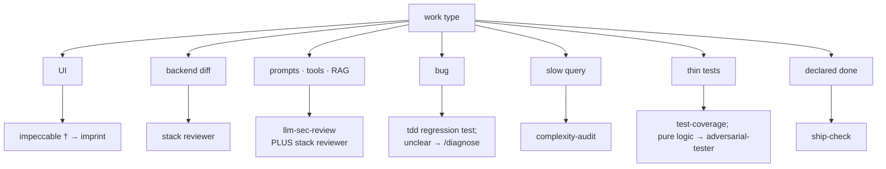

Pipeline order is load-bearing:

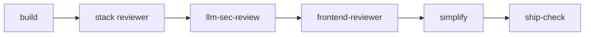

Routing is advisory. Recommend or invoke; never block on it.

---

## 5. PROCEDURE — install

**If the repo is private,** step 1 needs credentials. On a machine the operator does
not fully control, **do not run `gh auth login`** — that authorises the whole account.
Direct them to a fine-grained token scoped to this repository only, `Contents:
Read-only` (read/write only if they will push back), pasted as the password at the
`git clone` prompt. Revoking it on GitHub cuts that machine off without affecting
anything else. Never ask for, echo, or store the token value.

| # | Step | VERIFY |
|---|---|---|
| 1 | `git clone <repo> ~/ai-wow` | `bin/ai-sync` exists |
| 2 | `mkdir -p ~/.agents && ln -s ~/ai-wow/skills ~/.agents/skills` | directory lists **16** entries — **FAIL → STOP** |
| 3 | `python3 bin/ai-sync` | exit 0; `linked` lines emitted |
| 4 | `python3 bin/ai-sync status` | every category `linked`, `CLAUDE.md linked`, all four render lines `present`, `shared skills (~/.agents):  16` |
| 5 | optional: `cp local.config.example.json local.config.json` and edit | `managed_repos()` returns your paths |
| 6 | if step 3 reported symlink denial | switch to §8a copy mode — do not abandon the install |

Step 2 is the one that fails silently. Never report a successful install without the
count from step 4.

`ai-sync status` exits 1 when managed-doc drift exists. **That exit code is not an
install failure** — judge on the four VERIFY lines.

---

## 6. PROCEDURE — taskman

Preconditions, both required: `.taskman.toml` in cwd or an ancestor (I4), and a
reachable Postgres (I10).

URL resolution:

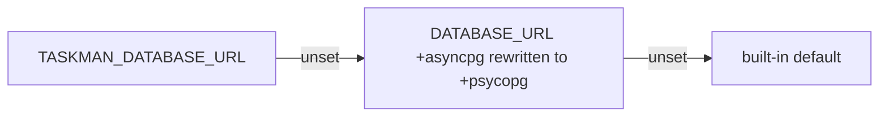

Command surface: `db` `init-db` `feature` `pbi` `task` `requirement` `decision`
`capture` `board` `session` `plan` `recommend` `wrapup`.

The `mow` scripts are separate console entry points, **not** `taskman` subcommands —
`mow-preflight`, `mow-hydrate-specs`, `mow-plan-import`, `mow-check-grill-writeback`,
`mow-set-registry-status`, `mow-check-ship-check`, `mow-check-action-report`,
`mow-check-tracker`, `mow-closeout`, `wrapup-reconcile`. Each is also runnable as
`python -m taskman.mow.<module>`, which is how the skills invoke them.

### Decision-task protocol

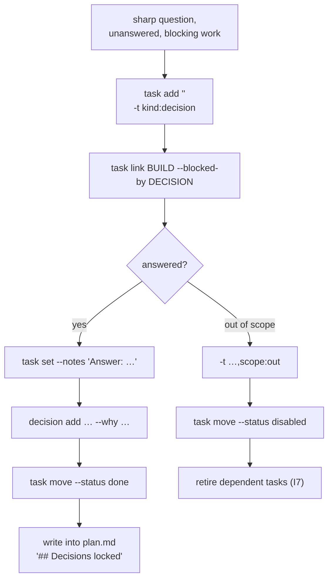

All four "answered" steps are required: board records *that*, log records *why*,
plan records *what*. A question you cannot yet phrase precisely is **fog, not a board
row** — it belongs under `## Not yet specified` in the plan.

Applies here: **I5** (read tags before replacing), **I6** (no brief `source_ref`),
**I7** (disabled blockers hide dependents), **I9** (`disabled` ≠ `done`).

---

## 7. PROCEDURE — mow

Mode dispatch, **first match wins**: `go`|`dispatch` → go · `ready` → ready ·
`list` → list · otherwise → plan.

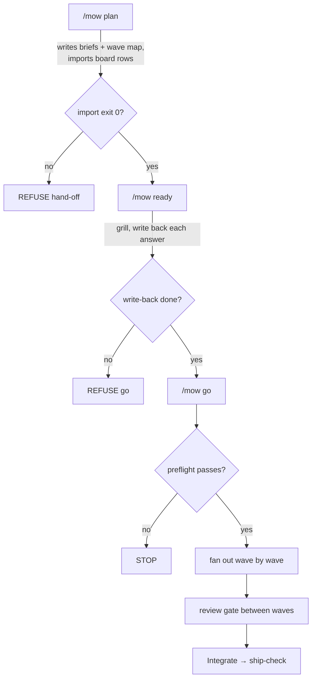

**I3 is the hard rule** — same-wave lanes own disjoint file sets. Thin briefs are
refused, not dispatched.

Mandatory auto-invocations (skip only on explicit operator instruction or a written
n/a in the report):

| Point | Invoke |
|---|---|
| ready, before go | `grill-with-docs`, one Q at a time, write back before the next |
| go, before wave 1 | preflight: grill → hydrate → thin-brief → overlap |
| lane start | `tdd` **before** production code |
| lane mid-build | `parallel-debug` on >1 unrelated failure |
| lane mid-build, UI | project `ui-designer` + `impeccable` † |
| lane verification, UI | `imprint` |
| lane verification, new logic | `test-coverage` |
| lane verification, pure logic | `adversarial-tester` |
| Integrate | `ship-check` as auto-gate |
| Integrate, before the `Status: shipped` flip | close-out gate — `python -m taskman.mow.closeout docs/plans/<stem>` |

**The close-out gate refuses, it does not warn.** It exits **3 and writes nothing** when
the run is not fit to be called finished: no ship-check verdict (or one stale against
`plan.md`), an action report that is missing, skeletal or unlinked, a tracker still
holding `running` lanes or findings with no triage record. Warnings print but never
block. Fix what it names and flip again — **never hand-edit the registry row to route
around it**, which is the documented fallback only when the script is absent from the
repo. Preflight refuses a run unfit to start; this refuses one unfit to be called done.

---

## 8. EDITOR SURFACES — VS Code, Cursor, CLI

**All Claude Code surfaces read the same `~/.claude`.** There is no VS Code-specific
config format, no workspace setting, and nothing to place in `.vscode/`. If the CLI
sees the harness, so does the extension.

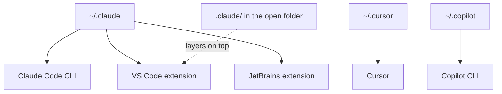

Two editor-specific facts that do matter:

| Fact | Consequence |
|---|---|
| The integrated terminal's default shell runs the hooks | On Windows it must be **Git Bash**, or hooks may not fire. Nothing else is affected |
| A project `.claude/` layers over `~/.claude` | Do not register hooks there — I8 (double execution) |

Do **not** tell a user to add VS Code settings for this harness. There are none.

### Copilot — which surface

`~/.copilot/` is **Copilot CLI**, and that is where the hook renders were verified live
(CLI 1.0.80, 2026-08-21). Do not promise the same under the VS Code extension.

| Surface | Reads | Does not read |
|---|---|---|
| Copilot CLI | `~/.copilot/agents`, `~/.copilot/hooks/ai-wow.json`, `~/.copilot/mcp-config.json`, `~/.agents/skills` | — |
| Copilot in VS Code | `~/.agents/skills`, `.github/prompts/*.prompt.md` | everything under `~/.copilot/` |

Two consequences to state rather than discover:

- **`stamp-tracker-spawn` is inert under Copilot even on the CLI.** `SubagentStart`
  delivers Copilot's native camelCase payload with no `tool_input`, so the hook runs,
  exits 0, and stamps nothing. It cannot be fixed by renaming keys.
- **A VS Code-only user has no hooks, subagents or MCP from this harness.** The
  standing-instructions surface there is a per-repo `.github/copilot-instructions.md`,
  which `ai-sync` does not render; `templates/copilot-instructions.template.md` is the
  starting point. Never tell them a hook is guarding anything.

Hook event names render in **PascalCase** for Copilot deliberately — the casing selects
the Claude-compatible payload contract on both sides. Do not "normalize" it to camelCase.

## 8a. PROCEDURE — machines that forbid symlinks

Corporate Windows builds can pin Developer Mode off by group policy. `ai-sync`
handles this: `can_symlink()` probes once, before anything is deleted, and falls
back to mirroring.

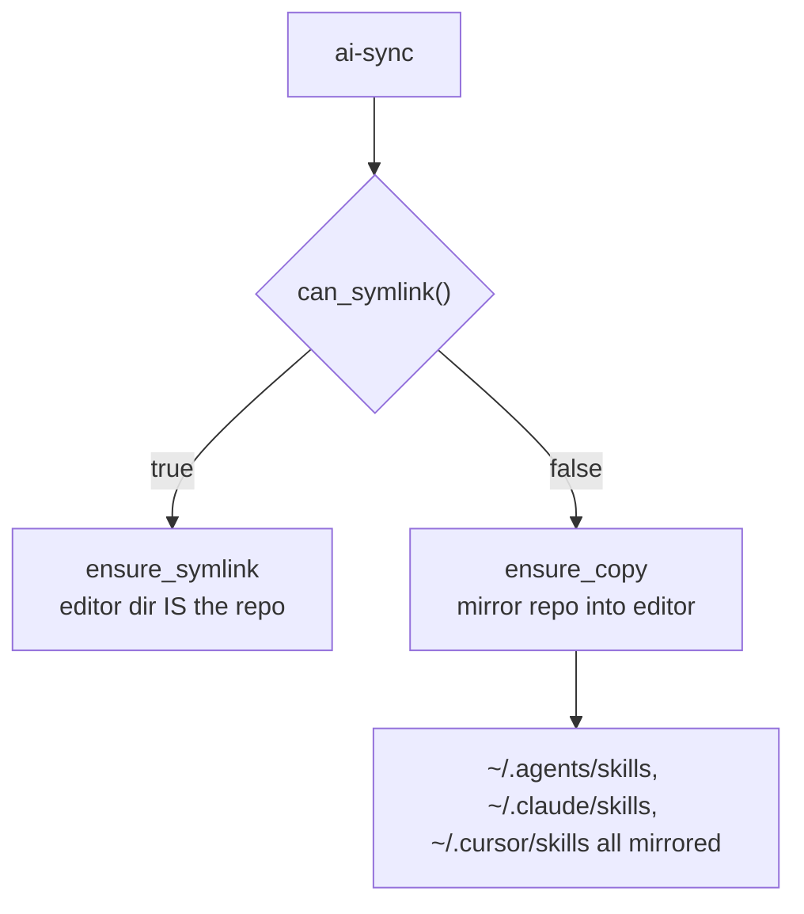

Force it explicitly when you want deterministic behaviour rather than
capability-dependent behaviour:

```bash
python3 bin/ai-sync --copy          # one run
# or, permanently, in local.config.json:
# { "link_mode": "copy" }
```

**VERIFY:** `ai-sync status` prints `link mode: copy` and each category reads
`copied (in sync)`. Status reads the installed state off disk, not the machine's
symlink capability, so a one-shot `--copy` still reports `copy` on later runs.

**Behavioural difference you must communicate.** In symlink mode the editor
directory *is* the repo, so edits either side are the same file. In copy mode they
are not:

| Edited in the editor | Recovered on next `ai-sync`? |
|---|---|
| Subagent (`agents/*.md`) | Yes — the import step pulls it back |
| Slash command (`commands/*.md`) | Yes |
| Hook script (`hooks/*.sh`) | Yes |
| **Skill (`skills/<name>/SKILL.md`)** | **No — it is overwritten** |

In copy mode, instruct the user to edit skills in the repo and re-run `ai-sync`.
Never edit a skill in the mirrored copy.

## 9. PROCEDURE — Windows install delta

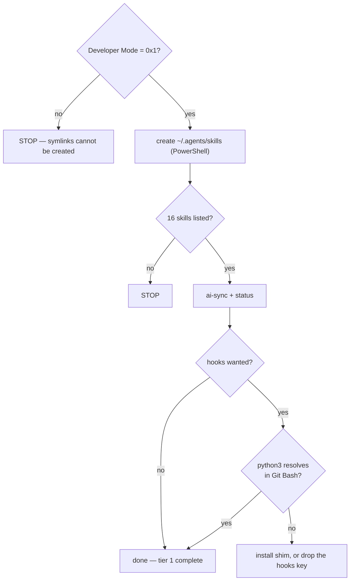

Check Developer Mode:
`reg query "HKLM\SOFTWARE\Microsoft\Windows\CurrentVersion\AppModelUnlock" /v AllowDevelopmentWithoutDevLicense` → `0x1`.

Hook scripts are bash and invoke `python3` first, then fall back to `python` automatically. A shim is only required if **neither** `python3` nor `python` resolves in Git Bash. Verify from **Git Bash**, not `cmd`. Standard Windows Python installs (python.org or Microsoft Store) provide `python`; `python3` is available after running `python3` once from the Store, or via a PATH shim.

Hooks are optional and nothing in the core depends on them. **Never let a hook
failure block the install** — report it and continue.

If Developer Mode cannot be enabled, do not stop: fall back to §8a copy mode.

---

## 10. REPORTING RULES

- Report VERIFY outcomes with the actual observed value ("`shared skills: 16`"), not
  "verified".
- If a step was skipped, say which and why.
- If a check could not run, say so — do not infer a pass from an adjacent success.
- Distinguish **CONFIRMED** (you ran it and saw the result) from **PLAUSIBLE** (it
  follows from what you read).
