# How to use this harness

**Audience:** a person setting this up and working with it day to day.
There is a companion document written for an agent to execute:
[`HOW-TO-USE.agent.md`](HOW-TO-USE.agent.md). Same system, different shape — that one
is numbered steps with pass/fail conditions; this one explains why the pieces are
arranged the way they are.

---

## Contents

1. [What this is](#1-what-this-is)
2. [The three mechanisms](#2-the-three-mechanisms)
3. [How config reaches your tools](#3-how-config-reaches-your-tools)
4. [Install](#4-install)
5. [Working without a board](#5-working-without-a-board)
6. [The board](#6-the-board)
7. [Orchestrating multi-step work](#7-orchestrating-multi-step-work)
8. [Session lifecycle](#8-session-lifecycle)
9. [Extending it](#9-extending-it)
10. [Appendix A — Windows](#appendix-a--windows)
11. [Appendix B — troubleshooting](#appendix-b--troubleshooting)

---

## 1. What this is

A portable configuration layer for AI coding agents. It gives an agent a set of
**procedures** to follow, a set of **specialists** to delegate to, and a set of
**guarantees** that fire whether or not the agent remembers them — then keeps all of
that identical across two editors and every machine you work on.

Three problems it solves, in order of how much they hurt:

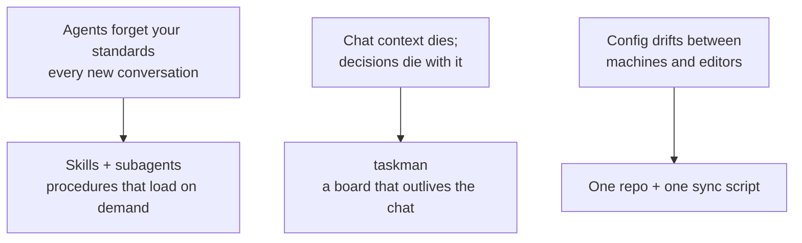

You can adopt these in that order. The first needs no configuration at all; the
second needs a database; the third needs one symlink and a script.

---

## 2. The three mechanisms

Almost everything here is a skill, a subagent, or a hook. Knowing which one you're
looking at explains most of its behaviour.

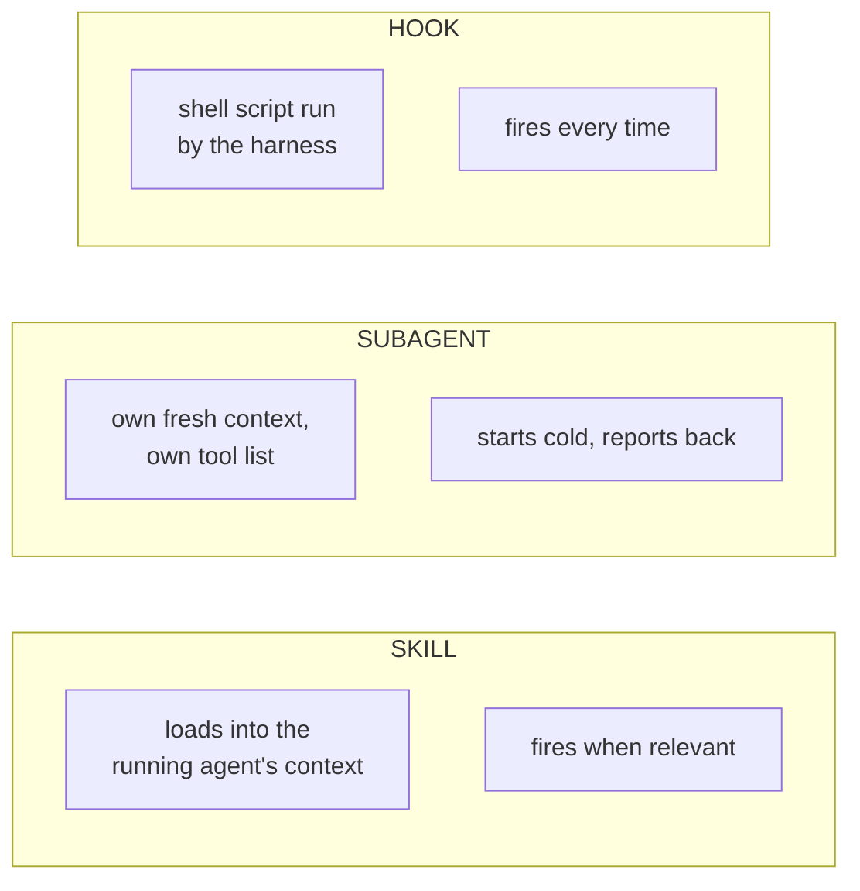

The practical rule:

| You want… | Use | Because |
|---|---|---|
| A procedure followed *when it applies* | **Skill** | It's advice the agent reads; it costs nothing when unused |
| An isolated job with a clean slate | **Subagent** | Its context can't pollute yours — but spinning one up isn't free |
| Something to happen **without fail** | **Hook** | It isn't the agent's decision |

A guarantee you implement as a skill is a suggestion. A suggestion you implement as
a hook is an annoyance. Match the mechanism to the intent.

---

## 3. How config reaches your tools

One repo is the source of truth. Two delivery mechanisms, chosen per category.

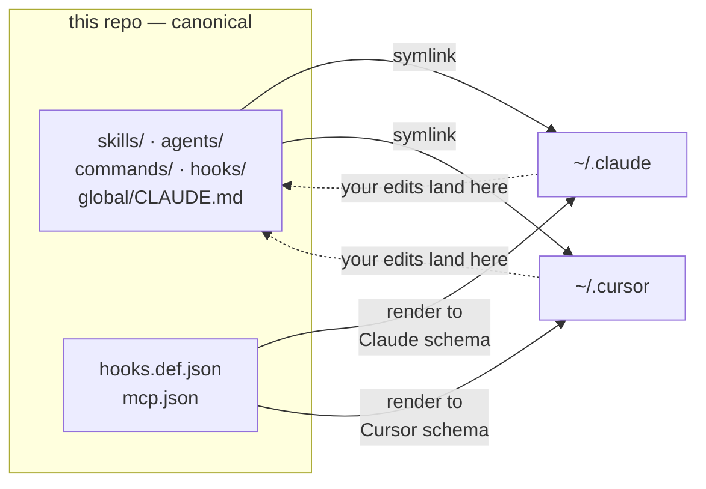

**Why not symlink everything?** Skills, subagents, commands and hook *scripts* use
an identical on-disk format in both editors, so a symlink means the editor's
directory *is* this repo — zero drift, and editing from inside either tool writes
straight back here. Hook *registration* and MCP config use **different schemas** per
editor, so they can't be shared as files; `ai-sync` translates one neutral
definition into each editor's dialect.

Skills take one extra hop, and it's the hop that breaks:

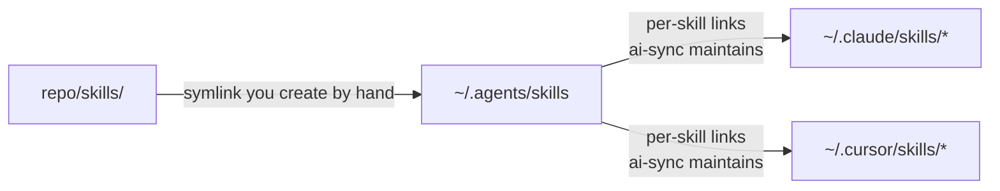

`ai-sync` maintains the second arrow but **not the first**. If `~/.agents/skills`
doesn't exist, the skill step returns immediately and you get zero skills with no
error message. Make that link before the first sync.

### What `ai-sync` does

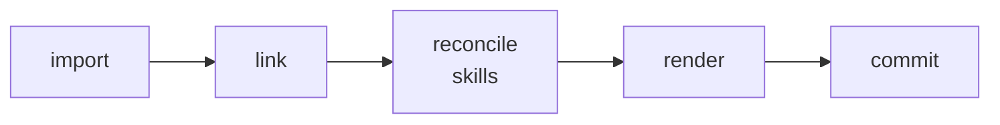

- **import** — pull anything you created inside an editor into the repo
- **link** — point the editor directories at this repo
- **reconcile** — make both editors expose the same skill set
- **render** — write `hooks.def.json` and `mcp.json` into each editor's own format
- **commit** — stage everything and commit

> ⚠️ **`ai-sync` commits with `git add -A` and pushes without asking.** It is
> registered as a session-end hook, so this happens on its own. Never leave anything
> private in the working tree.

---

## 4. Install

```bash
git clone <this-repo> ~/agent-harness
mkdir -p ~/.agents && ln -s ~/agent-harness/skills ~/.agents/skills
python3 ~/agent-harness/bin/ai-sync
python3 ~/agent-harness/bin/ai-sync status
```

`status` is the thing to trust — it reports what is actually linked rather than what
should be:

```
.claude/agents    linked
.claude/commands  linked
.claude/hooks     linked
.claude/CLAUDE.md linked
shared skills (~/.agents):  15
```

Anything `ai-sync` overwrites is copied to `.backups/<timestamp>/` first, so a wrong
first run is recoverable.

**Machine-specific settings never enter the repo.** If you want the managed-doc
render pointed at your own projects, copy `local.config.example.json` to
`local.config.json` — that filename is gitignored:

```json
{ "managed_repos": ["~/projects/my-api", "~/projects/my-web-app"] }
```

Absent or empty is a valid state. That feature simply doesn't run.

Windows needs three extra things — see [Appendix A](#appendix-a--windows).

---

## 5. Working without a board

Everything in this section runs on a bare clone. No database, no API key, no project
config. This is most of the value.

**Seven subagents.** Each gets its own context window and a restricted tool list.

| Subagent | Reviews or builds | Use when |
|---|---|---|
| `backend-reviewer` | reviews | A FastAPI / SQLAlchemy async diff is ready to commit |
| `django-reviewer` | reviews | Same, on Django/DRF |
| `frontend-reviewer` | reviews | A React / Next.js diff — correctness, not looks |
| `llm-sec-review` | reviews | The diff touches prompts, tool-calling, agents or RAG |
| `ui-designer` | builds | Any visual work; it is the design authority |
| `tdd-builder` | builds | A scoped task with acceptance criteria |
| `teacher` | builds | You want to learn something over time, not get one answer |

Two invariants make this work: **reviewers never build**, and **`tdd-builder` never
commits**. If the thing that writes the code is also the thing that approves it, the
review gate means nothing.

**Fifteen skills**, in four families:

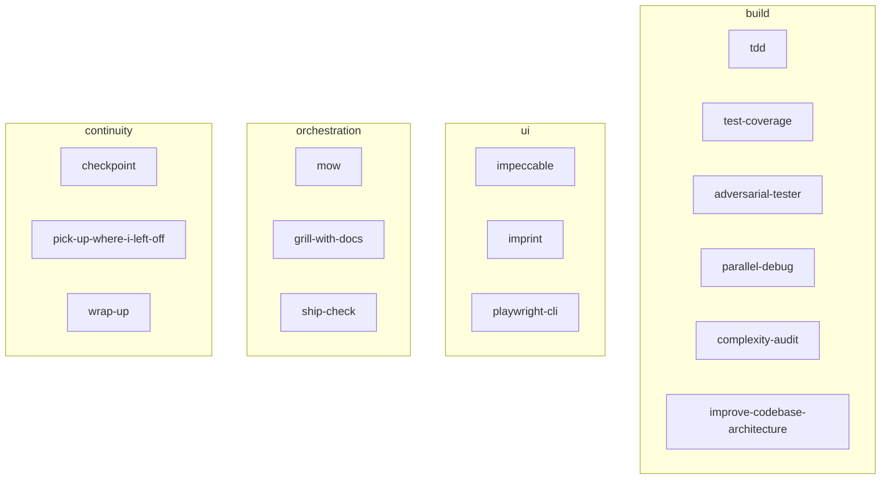

### Routing

Reach for the specialist rather than asking the generalist to try harder.

| The work smells like | Reach for |
|---|---|
| Building a feature, or fixing a bug | `tdd` — write the failing test first |
| A backend diff ready to commit | the stack reviewer subagent |
| Prompts, tools, agents, RAG | `llm-sec-review` **in addition to** the stack reviewer |
| A page, screen, component, mobile layout | `impeccable` while building, `imprint` after |
| A slow endpoint or a new list query | `complexity-audit` |
| New logic with thin tests | `test-coverage`; pure logic → `adversarial-tester` |
| Two or more *unrelated* test failures | `parallel-debug` |
| A bug that isn't yielding | `/diagnose` |
| "I think it's done" | `ship-check` |

Routing is advice, not a gate. Recommend or invoke; don't block on it.

### The review pipeline

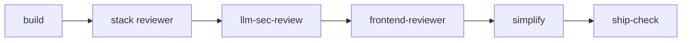

The order is load-bearing: correctness, then security, then presentation, then
cleanup, then the gate. Polishing code that's about to be rewritten for a security
finding is wasted work.

---

## 6. The board

`taskman` is a per-project board — no web UI, nothing to deploy. A CLI that talks to
Postgres and prints tables. It exists because **chat context dies and the board
doesn't**.

Adopt it when you have work spanning more sessions than you can hold in your head.

### Shape of the data

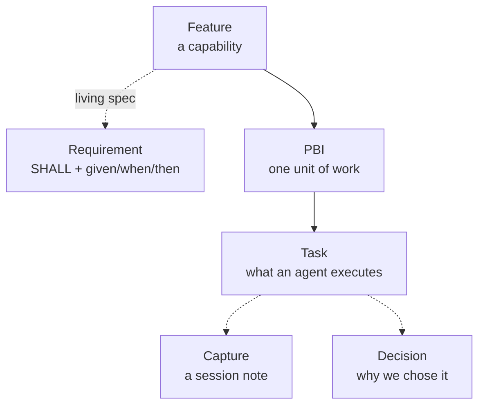

A **Requirement** is capability-level truth — what the system must do. A **PBI's**
acceptance criteria scope one piece of work. Confusing the two produces a spec that
rots, because it was really a to-do list.

### Statuses

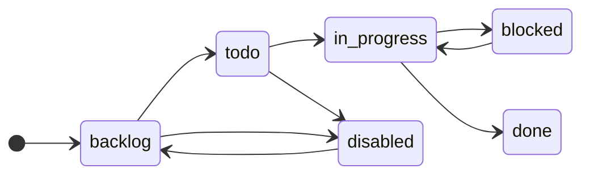

`disabled` sits deliberately off the main line: *retired until explicitly
revisited*. It exists because marking something `done` that never happened is a lie
the board carries forever.

### Two rules worth learning early

**Identity is never guessed.** taskman walks up from your working directory looking
for `.taskman.toml`. No marker, no operation. That is how two projects sharing one
Postgres never mix rows.

**Tags replace, they don't append.** `task set <id> -t a,b` discards existing tags.
Read them with `task show <id>` first.

### Decision tasks

A question sharp enough to state precisely, not answered yet, with build work behind
it. It's an ordinary task tagged `kind:decision` where **the title is the question**.

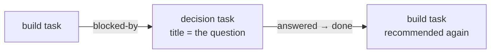

Resolving takes three commands and one file edit, and all four matter: record the
answer on the task, log *why* in the decision log, move it to `done`, then write the
locked answer into the plan. The board records that it closed; the log records why;
the plan is where the next agent reads what.

> ⚠️ Never give a decision task a dispatch-brief `source_ref`. The end-of-run sweep
> marks every task whose `source_ref` is one of the run's briefs as `done` — a
> decision task caught by it claims an answer nobody gave.

---

## 7. Orchestrating multi-step work

`mow` — Multi Agent Orchestration Workflow — is for the moment a planning session
ends with a dozen todos and neither option is good: keep building in a chat that's
already too long, or start each todo fresh and lose every decision you made.

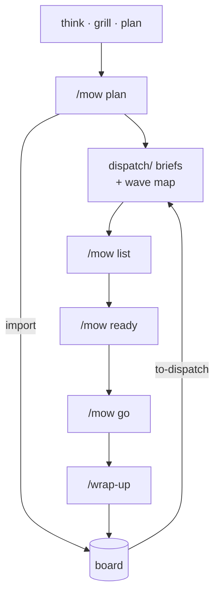

| Mode | Run it | It does |
|---|---|---|
| `plan` | in the chat where the decisions are still live | writes one brief per todo + the wave map, lands board rows |
| `list` | in a fresh chat | shows every active run with its full wave map |
| `ready` | before fan-out | grills the plan, one question at a time, writing each answer back |
| `go` | anywhere | fans out to subagents, wave by wave, review gate between waves |

**The hard rule:** lanes in the same wave own **disjoint file sets**.

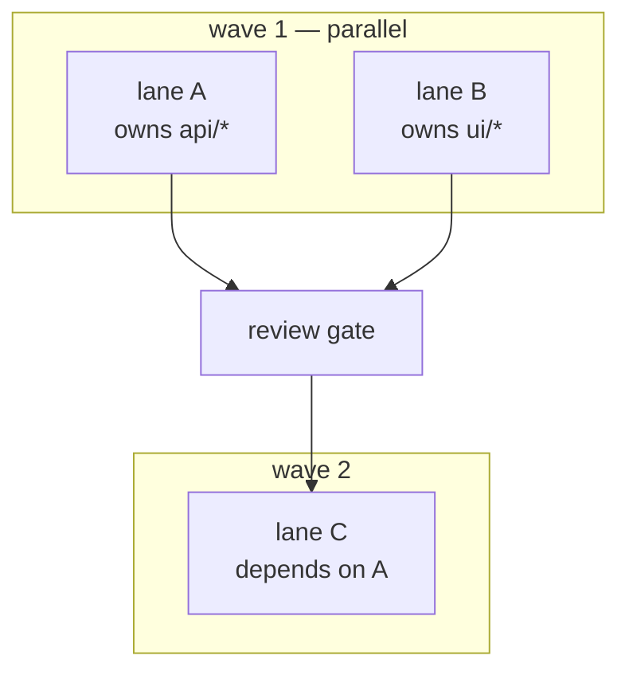

Two agents editing the same file in parallel is how you lose work. Overlap is
detected before fan-out, not discovered afterwards.

---

## 8. Session lifecycle

Three hooks and one skill bracket every working session.

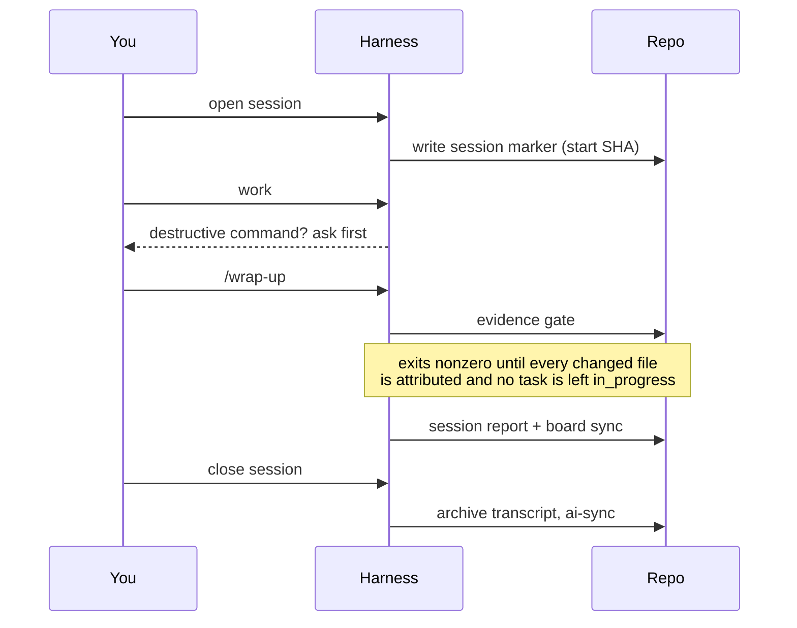

The evidence gate is the part worth understanding. It compares the files changed
since the session's start SHA against what the board says you did. Unattributed
changes and tasks abandoned mid-flight both block it. You clear them by citing what
happened — which is exactly the information a future you will want.

Every hook fails open. A broken hook never blocks the agent.

---

## 9. Extending it

| Change | Edit | Then |
|---|---|---|
| A skill | `skills/<name>/SKILL.md` | `ai-sync` |
| A subagent | `agents/<name>.md` | `ai-sync` |
| A slash command | `commands/<name>.md` | `ai-sync` |
| Global instructions | `global/CLAUDE.md` | already live — it's symlinked |
| Hook wiring | `hooks.def.json` | `ai-sync` |
| An MCP server | `mcp.json` | `ai-sync` |

Because the editor directories are symlinks into this repo, editing a skill from
inside your editor edits the repo. There is no copy step and no drift.

> ⚠️ **Register hooks in exactly one place** — `hooks.def.json`. Never hand-edit the
> rendered block in `settings.json`; it gets overwritten. And never re-register a
> hook in a project's own settings: two live registrations means everything runs
> twice.

Adopting the harness in a new repo is a separate checklist:
[`templates/BOOTSTRAP.md`](templates/BOOTSTRAP.md).

---

## Appendix A — Windows

The harness was written on macOS. The portable parts are genuinely portable; three
things need attention.

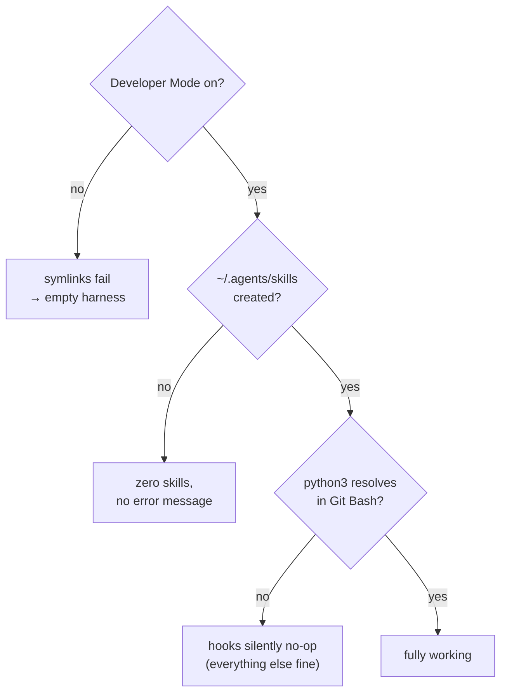

**1. Developer Mode.** Settings → System → For developers → On. Windows blocks
symlink creation for normal users otherwise, and the entire design is symlinks.

**2. The skills link**, in PowerShell:

```powershell
New-Item -ItemType Directory -Force -Path "$env:USERPROFILE\.agents"
New-Item -ItemType SymbolicLink -Path "$env:USERPROFILE\.agents\skills" `
         -Target "$env:USERPROFILE\agent-harness\skills"
```

**3. `python3`.** The hook scripts are bash and call `python3` by that exact name.
The python.org installer provides `python` and `py` but not `python3`. Either
install Python from the Microsoft Store — which ships a real `python3.exe` — or put
a `python3.bat` on PATH containing `@echo off` and `python %*`. Verify it from **Git
Bash**, not `cmd`; Git Bash is the shell the hooks actually run under.

Hooks are optional. Skills, subagents and commands don't touch them. If they won't
cooperate, delete the `hooks` key from `settings.json` and run `ai-sync` by hand.

---

## Appendix B — troubleshooting

| Symptom | Cause | Fix |
|---|---|---|
| No skills at all, no error | `~/.agents/skills` missing | Create it — `ai-sync` won't |
| Skills missing, subagents present | Skill farm not reconciled | Re-run `ai-sync`; `status` should show 15 |
| "privilege not held" on Windows | Developer Mode off | Enable it, re-run |
| Hooks never fire | `bash` or `python3` unresolvable | Appendix A step 3 |
| `status` exits 1 on managed-doc drift | `local.config.json` points at a repo that moved | Fix the path, or drop the entry |
| `taskman` refuses to run | No `.taskman.toml` in the tree | Add one at the project root |
| `taskman` can't connect | No Postgres, or no `TASKMAN_DATABASE_URL` | Start one; set the URL |
| Alembic "Can't locate revision" | Two taskman copies, one database, different migrations | Bring both to the same revision set |
