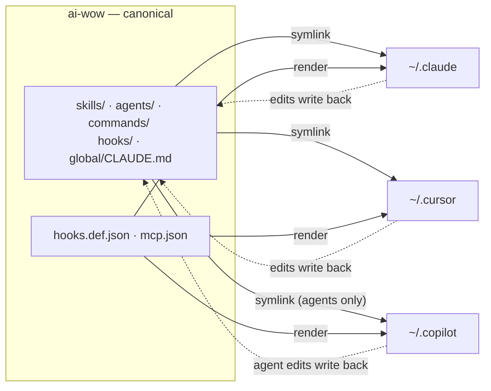
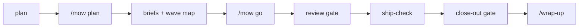

# ai-wow

### *AI — Way of Working*

**A portable way of working with AI coding agents.** Skills, subagents, slash
commands, lifecycle hooks, and a durable task board — versioned in one repo, synced
into Claude Code, Cursor, and GitHub Copilot by one script, identical on
every machine.

A team has a way of working: standards everyone follows, specialists you hand things
to, and checks that run whether or not anyone remembers them. Agents don't inherit
any of that by default — every conversation starts from nothing. This is that way of
working, made portable and enforced.

```bash
git clone <this-repo> ~/ai-wow
mkdir -p ~/.agents && ln -s ~/ai-wow/skills ~/.agents/skills
python3 ~/ai-wow/bin/ai-sync
python3 ~/ai-wow/bin/ai-sync status
```

> **Start here:** [`HOW-TO-USE.human.md`](HOW-TO-USE.human.md) if you're a person ·
> [`HOW-TO-USE.agent.md`](HOW-TO-USE.agent.md) if you're an agent.

---

## What's in it

| | Count | |
|---|---|---|
| **Skills** | 16 | Procedures an agent loads into its own context on demand |
| **Subagents** | 8 | Specialists with isolated context and restricted tools |
| **Slash commands** | 1 | `/diagnose` — a discipline for hard bugs |
| **Hooks** | 9 | Guarantees that fire on lifecycle events, not on the agent's judgment |
| **Board** | 1 package | `taskman` — Feature → PBI → Task, living spec, decision log |

Everything except the board runs on a bare clone: **no configuration, no API keys,
no database.**

### One optional extra

`impeccable` — the UI design skill — is referenced throughout the docs but is **not
bundled**: it is Apache-2.0 and roughly 99 files, better taken from its own source
than vendored here.

```bash
npx skills add pbakaus/impeccable
```

Nothing else depends on it. See [`THIRD-PARTY.md`](THIRD-PARTY.md).

---

## How it works

One repo is the source of truth. Portable content is **symlinked** into each editor,
so the editor's directory *is* this repo — zero drift, and edits made from inside an
editor land back here. Hook registration and MCP config use different schemas per
editor, so those are **rendered** from one neutral definition instead.



Copilot's skills are already covered without any of the above: it searches
`~/.agents/skills` directly, the same symlink Claude Code and Cursor use — one
skill farm, three tools. Subagents get a dedicated `~/.copilot/agents` symlink
because Copilot's *personal* custom-agent path differs from Claude's. Hooks and
MCP are rendered into Copilot's own schema, same as Cursor's.

> [!NOTE]
> **Which Copilot.** The hook, subagent and MCP renders target **Copilot CLI**, and
> that is where they were verified live (CLI 1.0.80, 2026-08-21): `ai-sync` renders
> PascalCase event names, which Copilot answers with the Claude-compatible payload on
> both sides, so the scripts run unchanged — `guard-destructive` denied a real command,
> and `Stop` fires. The one mapping that does not survive is `stamp-tracker-spawn`:
> `SubagentStart` delivers Copilot's native payload with no `tool_input`, so the hook
> runs, exits 0, and stamps nothing. That is not fixable by renaming keys.
>
> In **VS Code**, the extension shares the `~/.agents/skills` farm and picks up slash
> commands as `.github/prompts/*.prompt.md`, but the `~/.copilot/` renders are CLI
> paths — nothing reads them there. For a VS Code-only setup, the standing-instructions
> surface is `.github/copilot-instructions.md`; a starting point ships in
> [`templates/copilot-instructions.template.md`](templates/copilot-instructions.template.md).

`ai-sync` runs `import → link → reconcile skills → render → commit`, and is
registered as a session-end hook so it happens on its own.

> [!IMPORTANT]
> `ai-sync` **will not create `~/.agents/skills`**. Without that symlink the skill
> step returns early and you get zero skills with no error. Make it before the first
> sync — it's the one step that fails silently.

> [!WARNING]
> `ai-sync` **pushes without prompting** when a remote exists. On machines that must
> never push (a corporate laptop), set `{ "push": false }` in `local.config.json` —
> commits stay local.
>
> It commits **only the paths it manages** — the linked category directories plus
> `skills/` and `skills.lock.json`, derived from the link tables rather than
> hardcoded — staged and committed by name, never `git add -A`. Anything else in the
> tree is left alone, and it logs what it left behind rather than narrowing scope
> silently. So a half-finished refactor or a peer session's staged file cannot ride
> along in a `sync:` commit.

---

## The three mechanisms

| | Context | Fires | Use for |
|---|---|---|---|
| **Skill** | the running agent's own | when relevant | a procedure worth following |
| **Subagent** | fresh and isolated | on explicit call | a job that needs a clean slate |
| **Hook** | none — shell | every time | something that must not be skipped |

A guarantee implemented as a skill is only a suggestion. Match the mechanism to the
intent.

---

## The build loop



Work is decomposed into per-todo briefs and a wave map, fanned out to subagents wave
by wave with a review gate between waves, then closed out through an evidence gate
that will not pass while changed files are unattributed or tasks are left in flight.

**Two of those gates are scripts, not judgment.** `taskman.mow.preflight` refuses to
fan out a run that is not fit to start; `taskman.mow.closeout` refuses the
`Status: shipped` flip — exit 3, writing nothing — when there is no ship-check verdict,
a missing or skeletal action report, or a tracker still holding running lanes. The
scripts hold the accounting; the verdict stays human.

**The hard rule:** lanes in the same wave own disjoint file sets. Overlap is detected
before fan-out, not discovered afterwards.

---

## Layout

| Path | What |
|---|---|
| `skills/` | 16 skills, each `<name>/SKILL.md` |
| `agents/` | 8 subagent definitions |
| `commands/` | Slash commands |
| `hooks/` + `hooks.def.json` | Hook scripts and their neutral registration |
| `global/CLAUDE.md` | Global instructions symlinked to `~/.claude/CLAUDE.md` |
| `taskman/` | The board package — CLI, models, migrations, 187 tests |
| `docs/workflow/` | Work-loop, dispatch bridge, compact template |
| `templates/` | Bootstrap checklist for adopting the harness in a new repo, plus per-repo starting points (protocols, `ui-designer`, Copilot instructions) |
| `bin/ai-sync` | The sync tool |
| `local.config.example.json` | Copy to `local.config.json` (gitignored) for machine paths |

Machine-specific configuration lives only in `local.config.json`, which is
gitignored. Nothing in the tracked tree points at a particular machine or project.

---

## Requirements

- **Core** — Python 3 and git. That's it.
- **Board** — optional. A committed `board/` directory next to `.taskman.toml`
  (Python 3.12+ for the CLI). Standing one up is in
  [§6 of the human guide](HOW-TO-USE.human.md#standing-one-up). The harness
  itself needs no board, and
  [§5](HOW-TO-USE.human.md#5-working-without-a-board) covers working without one.
- **Windows** — Developer Mode for symlinks, Git Bash, and a `python3` on PATH.
  See Appendix A of the human guide.

Check the harness itself after a fresh clone — no database, no dependencies, so
this runs anywhere the core does, a locked-down Windows box included:

```bash
bash githooks/pre-push
```

That runs the whole harness suite — ten files. It covers what a clone is most likely
to get wrong: whether the mow board times a backgrounded lane correctly, whether
`ai-sync status` reports the mode you actually installed with, whether `ai-sync`
commits only the paths it manages rather than sweeping the tree, whether every text
file it touches is read and written as UTF-8, whether the session hooks behave when a
peer session is live, and whether the inventory counts in this README still match what
is on disk.

Run any one of them directly — they take no arguments:

```bash
python3 bin/tests/test_repo_shape.py
```

Have git run them for you before every push — this repo is public, and the
scrub test is what keeps employer and personal strings out of it:

```bash
git config core.hooksPath githooks
```

`githooks/pre-push` then blocks any push whose tests fail, and `git push
--no-verify` bypasses it when you mean to. The setting is per-clone and not
carried in the repo, so a fresh clone is unprotected until you run that line.

Run the board's tests — they use a tmp `board/` and need no database:

```bash
cd taskman
uv run --group dev pytest -q
```

---

## Docs

| Doc | For |
|---|---|
| [`HOW-TO-USE.human.md`](HOW-TO-USE.human.md) | Setup, mental model, day-to-day use, Windows appendix |
| [`HOW-TO-USE.agent.md`](HOW-TO-USE.agent.md) | Invariants, decision trees, procedures with VERIFY conditions |
| [`templates/BOOTSTRAP.md`](templates/BOOTSTRAP.md) | Adopting the harness in a new repo |
| [`templates/copilot-instructions.template.md`](templates/copilot-instructions.template.md) | Standing instructions for a repo worked on in Copilot for VS Code |
| [`docs/workflow/work-loop.md`](docs/workflow/work-loop.md) | The operator's idea → board → build loop |
| [`taskman/taskman/README.md`](taskman/taskman/README.md) | The board package in depth |
| [`THIRD-PARTY.md`](THIRD-PARTY.md) | Which skills came from elsewhere, and under what terms |

---

## License

[MIT](LICENSE) for everything original to this repository — the thirteen original
skills, the eight subagents, `taskman`, `ai-sync`, and the docs.

Three bundled skills come from other projects and keep their own licenses:
`tdd` and `grill-with-docs` from [mattpocock/skills](https://github.com/mattpocock/skills)
(MIT), and `playwright-cli` from
[microsoft/playwright-cli](https://github.com/microsoft/playwright-cli) (Apache-2.0).
All three are unmodified; each carries its upstream license text in its own folder.
Details in [`THIRD-PARTY.md`](THIRD-PARTY.md).
