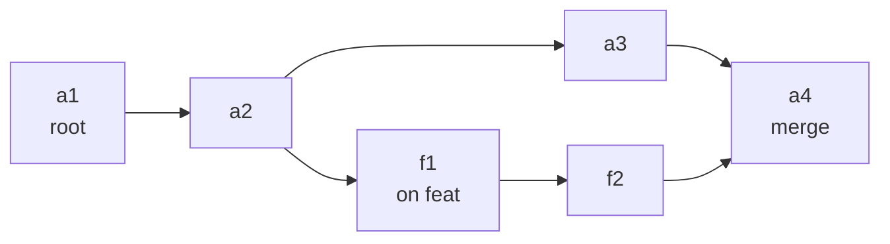

# Reading the git timeline — git, as your agents use it

The git timeline is a local page that shows every git operation your agent chats
ran, the branch history those operations produced, and who pushed what. This guide
explains the handful of git ideas the page is built on, then walks through the page
one card at a time.

It isn't a git tutorial. You won't find command syntax here beyond what's needed to
read the page, and nothing about setting the tool up: that's in the
[`bin/git-timeline`](../../bin/git-timeline) docstring.

It exists because the page shows a lot at once. Agents run hundreds of git commands
a day, and without the vocabulary a branch that curves back into `main`, a push bar
that hangs below the line, or a commit marked *ambiguous* are just shapes.

A rendered view of this guide ships as `bin/git-timeline-guide.html` and is written
next to the timeline page every time it is built. This markdown file stays the
source; change it first, then the view.

## Contents

- [Opening and refreshing the page](#opening-and-refreshing-the-page)
- [Commits and branches](#commits-and-branches) — the chain everything else hangs off
- [Your copy and the remote](#your-copy-and-the-remote) — push, fetch, pull, and `origin/main`
- [Worktrees](#worktrees) — why agents work in separate folders
- [How branches come back together](#how-branches-come-back-together) — merges, fast-forwards, rebases, squashes
- [The reflog](#the-reflog) — git's own diary, and where the push report comes from
- [Reading the page](#reading-the-page) — card by card
- [Answering real questions with it](#answering-real-questions-with-it)
- [What it cannot tell you](#what-it-cannot-tell-you)
- [Sources](#sources)

---

## Opening and refreshing the page

There are two ways to open it, both from the ai-wow checkout. The live one serves
the page on your machine and refreshes its data every 30 seconds, so new git ops,
commits and pushes appear while you watch:

```bash
python3 bin/git-timeline serve --open
```

It answers at `http://127.0.0.1:8390/git-timeline.html` (the next free port up to
8399 if that one is taken; running it twice reuses the first). It only listens on
your own machine and serves nothing but the page, its data and this guide. Stop it
with Ctrl-C.

The other is a snapshot file that works with no server at all, and shows the log as
it was when you built it:

```bash
python3 bin/git-timeline html --open
```

The hook keeps logging on its own while agents work. Two commands you'll want
occasionally: `git-timeline backfill` imports git calls from old chat transcripts
(safe to repeat), and `--no-prs` skips asking GitHub for pull requests, which saves
a few seconds.

## Commits and branches

A commit is a saved snapshot of the whole project, and every commit points back
to the one before it. That backward link, the *parent*, is what turns snapshots
into history. A commit is named by its sha, a long hexadecimal id like
`351c0a9f…`; the page shows the first seven or eight characters, which is enough to
be unique in practice.

A branch is only a label that points at one commit, the newest on that line of
work. When you commit on a branch, git makes the new commit and moves the label
forward. `main` (or `master` in older repos) is the branch everyone agrees is the
real history. `HEAD` means "the commit I'm standing on right now".



Read the arrows as "comes after". `feat` split from `main` at `a2`, got two commits
of its own, and was merged back in `a4`, a commit with two parents. The Journey
card draws exactly this shape, sideways, with time running left to right.

## Your copy and the remote

Every clone is a full, independent copy of the repository. GitHub holds one more
copy, called the *remote*, and by convention it is named `origin`. Nothing moves
between your copy and `origin` until you ask:

| Command | Direction | What moves |
|---|---|---|
| `git push` | yours → `origin` | your new commits, and the branch label moves on GitHub |
| `git fetch` | `origin` → yours | GitHub's new commits land in your copy; your own branches don't change |
| `git pull` | `origin` → yours | a fetch, then your branch is moved (merged or rebased) onto what arrived |

`origin/main` is the thing that trips people up. It's your copy's *memory* of where
`main` was on GitHub the last time you talked to it, a remote-tracking branch. It
only moves on push, fetch or pull. So "`main` is 3 ahead of `origin/main`" means you
have three commits GitHub hasn't seen yet, as of your last fetch, and could be out of
date.

## Worktrees

A worktree is a second (or tenth) folder checked out from the same repository. All
of them share one history, but each has its own `HEAD`, its own branch and its own
staging area. Claude's worktrees live under `.claude/worktrees/<name>/` and usually
sit on a branch named `worktree-<name>`.

Agents use them so that two chats can edit the same project without stepping on each
other. In a single shared folder one chat's `git checkout` or `git add` reaches into
the other's work, silently. Each worktree on the page is the repo it belongs to, so
a worktree's operations are counted under that repo and drawn as a dashed band on
its branch.

## How branches come back together

There are four ways work on a branch lands in `main`, and each leaves a different
shape on the Journey card. Knowing which one happened tells you whether the
original commits still exist.

| How | What git does | What the Journey shows |
|---|---|---|
| **Merge** | makes a new commit with two parents | the branch lane curves back into `main` at a hollow ring |
| **Fast-forward** | just moves `main`'s label forward; no new commit | no curve at all; the branch's commits simply become `main`'s line |
| **Rebase** | replays the branch's commits on top of the newest `main`, as new commits with new shas | the old commits disappear; the new ones fork later |
| **Squash merge** (on GitHub) | collapses the branch into one new commit on `main` | the branch lane is dashed: its original commits are gone, only the PR remembers it |

A **force push** is the one to watch. A normal push only adds commits. A force push
replaces what's on GitHub, and anything that was only there is dropped. Rebasing a
branch you already pushed needs one, and that's usually fine. A force push to `main`
rewrites everyone's history.

A **pull request (PR)** is GitHub's request to merge one branch into another, with a
number like `#104`, a review, and a state: open, merged, or closed without merging.

## The reflog

Your copy of git keeps a private diary. Every time a branch label moves, including
`origin/main`, git writes down when, from which commit, to which commit, and why:
`update by push`, `fetch: fast-forward`, `commit: …`. That diary is the *reflog*.

It's why the push report is exact rather than guessed. When `origin/master` moved
from `6d3f34c` to `c04d919` because of a push, the commits in between are precisely
what that push carried. The reflog lives only in your copy, and git clears it on
a schedule: entries older than 90 days by default, and after only 30 days for
entries the current branch no longer contains, which is what a force push or a
rewritten history leaves behind.

## Reading the page

The page follows one repository at a time; pick it from the row of buttons at the
top. The Journey, Push & pull and Chats cards share one time span, set by the
24h / 7d / 30d / All buttons. The session timeline shows one day, the latest or the
one you clicked; the command table lists days newest first, five at a time.

### Stat tiles and filters

The tiles count git operations for the repo, or for the focused day once you have
clicked one. Click a tile to list what it counts, right under the tiles: *Failed*
lists every failed command with the chat that ran it, its error, and the last commit
that chat had made in the repo before it (what it was working on); *Destructive*,
*Commits*, *Pushes* and *Git ops* work the same way, *~Tokens* lists the most expensive
git ops first, and *Sessions* lists the chats with their estimated tokens.
Click a row to jump to that command in its day's table. The category chips and the
search box filter the tiles, their lists, the session timeline and the command table;
the Journey, Push & pull and Chats ignore them.

| Category | Colour | Examples | Changes anything? |
|---|---|---|---|
| **Read** | gray | `status`, `diff`, `log`, `show` | no; it only looks |
| **Local write** | blue | `add`, `commit`, `checkout`, `worktree add` | your copy only |
| **Remote** | aqua | `push`, `fetch`, `pull`, `clone` | talks to GitHub |
| **Destructive** | red, diamond | `reset --hard`, `push --force`, `clean -f`, `branch -D` | can throw work away |

Most of what agents do is reading; a day with 80% gray is normal. Red is the category
worth a look every time.

### Journey

The branch map. `main` is the thick line on top. Each other lane is a branch: it
leaves `main` where it forked, and curves back where it merged. Filled blue dots are
commits, hollow rings are merge commits. A thin bar under a lane is a PR, labelled
`#n ✓` (merged), `#n open` or `#n ✕` (closed). A dashed lane is a PR whose branch
is gone, usually a squash merge. A dashed box is a worktree agents were working in.
Small triangles are pushes; diamonds are destructive operations.

Hover a commit to see who made it and who pushed it. Click it to jump the session
timeline and command table to that day. A lane named like `main (merged into x)`
means `main` was merged into branch `x` and then `x` was fast-forwarded into `main`,
which leaves `main`'s own commits on the side.

### Session timeline

One row per chat for the day in focus, with a dot per git operation. Dot colour is
the category; a hollow red ring is a command that failed. Click a dot to find it in
the command table.

### Push & pull

Commits moving between your copy and GitHub. Bars above the line are pushes, bars
below are fetches and pulls, and a bar's height grows with the number of commits.
A red cross is a push that failed, and a diamond on a bar marks a force push.
Below the chart, each row expands to list the exact commits that moved and the chat
that ran it. *Outside agents* means no logged chat ran it: you in a terminal, an IDE,
or a sync script.

### Chats

Each chat that made or pushed commits in view, by title, with what it made and who
pushed each commit. How sure the page is about who made a commit is written next to
it:

| Label | Meaning |
|---|---|
| (none) | exact: the commit's own sha was recorded when the chat made it |
| matched by message | the chat's `commit -m` text is this commit's subject |
| matched by time | the only chat committing within five minutes |
| ambiguous (+N) | N other chats were committing at the same time; the nearest is named |

Commits GitHub made itself (merging a PR on the website) are never credited to a chat.

### Command table

Every git command for the focused day, newest first: time, chat, operation, the
command itself, branch, estimated tokens, and whether it succeeded.

The **~Tokens** figure estimates what a command cost its chat in context: the
characters the command printed plus the command itself, divided by four (about one
token per four characters of English or code). Whatever a command prints stays in the
chat and is read again on every later turn, so a large `git diff` or a long `git log`
is the expensive habit, and `git status` is nearly free. When one Bash call runs
several commands (`git status && git diff`, or `cat notes.md && git log`), it hands back
one output for all of them. Each git row then shows its even share, marked `*`, split
across every command in the call, git or not, so nothing is counted twice and a file's
text is not charged to git; hover it for the whole call's total. Click the **~Tokens** tile for the most expensive git ops
first. It is an estimate of context, not your bill: billing is per model reply, and
a reply can run several commands. A `?` status means the result was
never recorded: the chat was still running when its transcript was read, or it was
stopped mid-command.

## Answering real questions with it

| Question | Where to look |
|---|---|
| Who pushed this commit? | hover it in the Journey, or find it in Push & pull |
| What did one chat change today? | Chats card → expand the chat |
| Did anything force-push or reset? | click the *Destructive* tile |
| Why did a push fail? | click the *Failed* tile and read the error under the command |
| Is my work on GitHub yet? | Chats card: *not pushed* next to a commit |
| What is costing my chats the most tokens? | click the *~Tokens* tile |
| What's that worktree for? | hover its dashed box in the Journey |

## What it cannot tell you

- **Anything older than about 90 days** in Push & pull (30 for history a force push
  replaced), because git clears the reflog. The operations log itself is kept forever.
- **Exactly who made a commit** that was committed quietly (`git commit -q -F file`)
  before the hook recorded shas, or from a folder named by a shell variable
  (`cd $DIR && git commit -q …`), which only the shell can expand. Those are matched by
  message or time and labelled so.
- **Who ran a push outside any chat.** It shows as *outside agents*.
- **Exact token counts.** The ~Tokens figures are estimated from text length, and a
  Bash call's output is shared evenly among all the commands it ran. Operations logged before
  sizes were recorded, and ones whose transcript is gone, show `—`.
- **Repos that have moved or been deleted**, or a folder given as a shell variable.
  Those operations are listed under *(no repo)* rather than guessed into the wrong repo,
  and a moved repo has no Journey.

## Sources

- [`hooks/git-ops.py`](../../hooks/git-ops.py) · how each git command is recognised,
  categorised and logged, and how a commit's sha is captured
- [`bin/git-timeline`](../../bin/git-timeline) · backfill, the commit graph, the push
  report (`sync_events`) and chat attribution (`commit_authors`)
- [`bin/git-timeline.html`](../../bin/git-timeline.html) · the page, including the
  Journey layout (`chainsOf`, `packLanes`)
- [`hooks/tests/test_git_ops.py`](../../hooks/tests/test_git_ops.py) · the behaviour
  above, pinned by tests
- `git help gc`, configuration section · `gc.reflogExpire` "defaults to 90 days" and
  `gc.reflogExpireUnreachable` "defaults to 30 days", read on 2026-09-25
