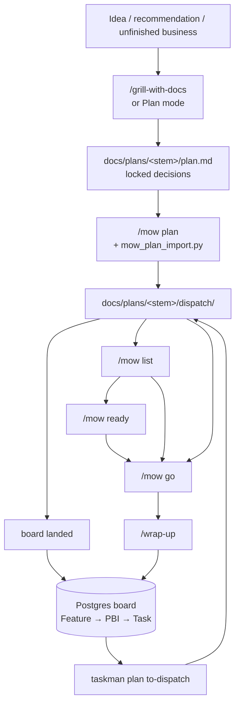

# Work loop — idea → board → mow

**Audience:** you (operator), not subagents.

This is the practical map for: *think of something → grill/plan in any chat → land it on the kanban board → run it as orchestrated multi-agent work*. Full skill catalog: [`skills-and-agents-guide.md`](./skills-and-agents-guide.md). Bridge spec: [`taskman-dispatch-bridge.md`](./taskman-dispatch-bridge.md).

**mow** = Multi Agent Orchestration Workflow (was `/dispatch-plan`). Modes: **`plan`** · **`list`** · **`ready`** · **`go`**.

---

## One sentence each (no overlap)

| Thing | Job | Does **not** |
|---|---|---|
| **Plan mode / any chat** | Think, recommend, draft a plan | Persist board rows or spawn lanes |
| **`/grill-with-docs`** | Stress-test decisions; lock SHALL+scenarios; agent syncs capture/decision/**requirement** | Build code; ask you to run taskman CLI |
| **`/mow plan`** | Rich briefs under `docs/plans/<stem>/`; prints **operator summary** + orchestration map; runs **`mow_plan_import.py`** so board rows land in the same step (+ requirements if missing) | Own the durable board forever without landing it |
| **`/mow list`** | Registry + operator summary + **full** waves/lanes maps for every active run + parallel-safe matrix | Fan out agents |
| **`/mow ready`** | Operator summary + full map + **grill checkpoint**; write each answer into `plan.md` + briefs before `done` | Fan out agents; mark grill done with chat-only locks |
| **`/mow go`** | Fan out briefs to subagents wave by wave; ends with past-tense **what we did / what you have now** | Rewrite the plan |
| **`taskman` CLI** | Durable Feature→PBI→Task + **Requirement** living spec | Spawn agents (skills call it) |
| **`taskman plan from-decisions/to-dispatch`** | Translate between board ↔ `dispatch/` folder | Decide *what* to work on |
| **`/wrap-up`** | End of chat: **evidence gate** (unattributed paths + stale `in_progress`) then board sync + **requirements** + session report | Replace live capture during work |
| **`taskman harvest`** | Safety net: mine archived transcripts → approve → board | Primary capture path |
| **`/checkpoint`** | Forward handoff for the *next* agent | Board sync (that's wrap-up) |

**Rule of thumb:** you invoke skills; **agents** run taskman CLI; the board + living-spec remember work; `docs/plans/<stem>/dispatch/` is the handoff format.

**Harness protocols:** QA gates at five trigger points — lane contracts (`/mow plan`), review wave (each `/mow go` wave), post-build testing (including **`/adversarial-tester`** once per batch — see protocols P3), merge gauntlet, periodic sweeps. Full spec: [`../agents/protocols.md`](../agents/protocols.md). Mental map: *put each check at the cheapest layer that can enforce it* — tests/lint in the lane, judgment in reviewer subagents, cadence in `/schedule`.

---

## The loop (happy path)



Canonical paths are under `docs/plans/<stem>/` (Cursor + Claude Code). `.cursor/plans/` is Cursor Plan-mode scratch only — promote into `docs/plans/` before running `plan from-decisions`. `list` always expands full waves/lanes for every active stem; `ready` zooms one stem.

### Step by step

**1. Capture thinking** — Plan mode, `/grill-with-docs`, or a random chat.  
Output you want: locked decisions + a plan file with todos (or a clear list of actionable items). Prefer writing `docs/plans/<stem>/plan.md`.

Before context gets long, persist the session in the [**compact template**](./mow-compact-template.md) — fill it at the end of the origin grilling/planning chat (or when running **`taskman harvest`** on archived transcripts) so Goal, Key Decisions, and file lists have a fixed shape instead of scattered chat bullets.

**2. Make it orchestratable** — in the *same* chat while context is hot:

```text
/mow plan
```

Writes `docs/plans/<stem>/dispatch/` (`INDEX.md` + one brief per todo) and **prints the orchestration map** (waves, lanes, AFK, roles, review flags). Runs **`uv run mow-plan-import docs/plans/<stem>`** in the same step so Feature/Task rows land on the board (refuses hand-off on exit 1).  
Each brief carries a `## QA contract` (from [`protocols.md`](../agents/protocols.md) P1); each wave ends in a **review gate** before the next starts. Thin briefs are refused.

**3. Confirm board** (optional — import already ran in step 2):

```bash
.venv/bin/python -m taskman board
```

Idempotent on `source_ref` — safe to re-run `mow_plan_import.py` after you edit briefs.

**4. Later: run work from the board** (statuses/deps may have changed):

```bash
.venv/bin/python -m taskman board
.venv/bin/python -m taskman plan to-dispatch --feature <id> --dir docs/plans/<stem>/dispatch
```

Then in any chat (often a **fresh** one):

```text
/mow list    # registry + full waves/lanes for every active stem
/mow ready   # zoom + grill; write-back to plan/briefs required before done
/mow go      # fan out (refuses if grill done without write-back line)
```

During **`/mow ready`**, if decisions or scope changed since `plan.md` was written, do a **grill write-back**: update the plan (and compact) using the same [compact template](./mow-compact-template.md) before fan-out — preflight expects locked decisions and file ownership to match the dispatch folder.

Before go (recommended — `uv run mow-preflight docs/plans/<stem>` now composes this check plus hydrate/thin-brief/overlap in one gate; run the standalone script only if you want the grill-write-back check alone):

```bash
uv run mow-check-grill-writeback docs/plans/<stem>
```

Prefer `plan to-dispatch` when the board is the source of truth; otherwise go with the on-disk folder as-is.

**5. Close the chat:**

```text
/wrap-up
```

Runs `uv run wrapup-reconcile` first (exit 1 until unattributed paths and session-touched `in_progress` are cleared with citations), then syncs board / requirements, writes a session report, offers harvest.

---

## Two entry points (pick one)

### A — “I just finished grilling / planning”

Use when the plan is fresh and rich (files, roles, waves).

1. `/mow plan` → briefs + orchestration map  
2. `taskman plan from-decisions <dispatch-dir>` → board  
3. `/mow list` (full maps) then `/mow go <stem>` when ready to build — `/mow ready <stem>` if you only want one map  
4. `/wrap-up` when done

### B — “I already have board rows; I want to execute a slice”

Use for backlog Features that came from harvest or manual `task add` (may have thin briefs).

1. `taskman board` / `taskman feature list` — pick a Feature id  
2. `taskman plan to-dispatch --feature <id> --dir <dir>`  
3. Skim briefs — if `files` / role / acceptance are empty, fill them (or re-grill that slice) before going  
4. `/mow list` → `/mow go <stem>` (or `/mow ready <stem>` first)  
5. `/wrap-up`

---

## Board hygiene (quick reference)

```bash
.venv/bin/python -m taskman board
.venv/bin/python -m taskman feature list
.venv/bin/python -m taskman task add "…" -t tag1,tag2
.venv/bin/python -m taskman task move <id> in_progress
.venv/bin/python -m taskman decision add "…" --why "…"
.venv/bin/python -m taskman harvest
.venv/bin/python -m taskman task add "…?" -t kind:decision,plan:<stem>
.venv/bin/python -m taskman task link <build-id> --blocked-by <decision-id>
.venv/bin/python -m taskman task set <id> -t kind:decision,plan:<stem>,scope:out
.venv/bin/python -m taskman task move <id> --status disabled
```

Statuses: `backlog → todo → in_progress → blocked → done`.

`disabled` is a sixth status, off that line because it is not a step in it: it means *retired from consideration until explicitly revisited*, and rows in it are excluded from `taskman board`'s default view.

**Naming:** refer to a task by name, not a bare id — first mention `"Formation split units" (#231)`, later mentions the name alone. Tables keyed by id are fine. This is why `taskman board` renders blockers by title.

### Decision tasks — a question that blocks build work

A decision task is a **tag convention on an ordinary task** (`kind:decision`), not a separate row type. Raise one when a question is sharp enough to state precisely but is not answered yet, and build work behind it should stop being recommended until it is. (A question you *cannot* yet phrase precisely is fog, not a board row — it goes under `## Not yet specified` in the plan; see the [compact template](./mow-compact-template.md).)

**1. Raise it** — the title *is* the question:

```bash
.venv/bin/python -m taskman task add "Do formation splits store yards from the sideline or hash-relative offsets?" -t kind:decision,plan:<stem>
```

**2. Block the build work on it:**

```bash
.venv/bin/python -m taskman task link <build-task-id> --blocked-by <decision-id>
```

The build task then drops out of `taskman recommend next` until the decision task is `done` — no status juggling on the build task itself, and it comes back automatically the moment the question is answered.

**3. Resolve it** — four steps, in this order:

```bash
.venv/bin/python -m taskman task set <decision-id> --notes "Answer: yards in from the sideline, collected per formation."
.venv/bin/python -m taskman decision add "Formation splits store yards from the sideline" --why "Numbers stay fixed per hash; the setup UI collects them."
.venv/bin/python -m taskman task move <decision-id> --status done
```

Then write the locked answer into `docs/plans/<stem>/plan.md` under `## Decisions locked`. Do all four: the board row records *that* the question closed, the decision log records *why*, and the plan file is where the next agent reads *what* the answer was.

**Or rule it out of scope** — the question is real, this run will not answer it:

```bash
.venv/bin/python -m taskman task show <decision-id>   # read the current tags first: -t replaces, it does not append
.venv/bin/python -m taskman task set <decision-id> -t kind:decision,plan:<stem>,scope:out
.venv/bin/python -m taskman task move <decision-id> --status disabled
```

**`disabled`, not `done`** — `done` would falsely claim the work happened. An out-of-scope call does **not** go into `## Decisions locked`; it belongs in the plan's `## Out of scope`. And because only a `done` blocker clears `recommend next`, anything still linked `--blocked-by` a disabled decision task stays hidden — retire that build task too, or it will quietly never be recommended again.

**Never give a decision task a dispatch-brief `source_ref`.** `taskman plan mark-shipped` (run by `/mow go` Integrate) moves every task whose `source_ref` is in the run's own set of `dispatch/NN-*.md` brief paths (`taskman/cli.py:1701-1704`). Point `--source` at the plan (`docs/plans/<stem>/plan.md`), at the source file the question is about, or leave it off — then shipping the run leaves the question open, which is the intent: an unanswered question should survive the run that raised it.

Get this wrong and the question is silently marked `done` at Integrate, claiming an answer that was never given. It happened on the first run that used this convention (`#3092`, raised with a brief path and swept on the spot). There is no `task set --source`, so a mis-sourced row cannot be corrected afterwards — only reopened with `task move <id> --status backlog`.

---

## What to invoke when (decision table)

| Moment | Invoke |
|---|---|
| Vague idea / “should we…?” | Plan mode or plain chat → then `/grill-with-docs` if it might become real work |
| Decisions locked, multiple todos | `/mow plan` |
| Pick among runs / preview waves in a new chat | `/mow list` (full maps for all active) |
| Zoom one stem's map before go | `/mow ready <stem>` |
| Persist that plan on the kanban | `uv run mow-plan-import docs/plans/<stem>` (during `/mow plan`) |
| “What should I work on next?” | `taskman recommend next` |
| “What’s on the board?” | `taskman board` |
| “Run this Feature / slice with agents” | `taskman plan to-dispatch …` then `/mow list` → `/mow go <stem>` |
| Mid-chat: new task / status / decision | Live `taskman …` CLI (or let `/wrap-up` catch it) |
| Sharp question you can't answer yet, with build work behind it | `task add "<the question>" -t kind:decision,plan:<stem>` then `task link <build-id> --blocked-by <decision-id>` |
| That question just got answered | `task set --notes "Answer: …"` → `decision add … --why …` → `task move <id> --status done` → `plan.md` `## Decisions locked` |
| That question is real but not for this run | `task set <id> -t …,scope:out` + `task move <id> --status disabled` (never `done`) |
| End of every working chat | `/wrap-up` |
| Hand off to a *future* agent mid-epic | `/checkpoint` (optional; independent of wrap-up) |
| Resume after a break | `/pick-up-where-i-left-off` |
| Missed items in old transcripts | `taskman harvest` |

---

## Skills you can ignore for this loop

Build/review skills (`/tdd`, `/ship-check`, reviewers, `/impeccable`, …) sit *inside* a mow lane or a focused build chat. They are not part of board management.

Session continuity (`/checkpoint`, `/pick-up-where-i-left-off`) is orthogonal: handoff text for humans/agents, not the kanban.

---

## Phase 3 — automatic

These gates are enforced by repo scripts + taskman CLI (runtime-agnostic — same in Cursor and Claude Code):

- **Plan import** — `/mow plan` runs `mow-plan-import`; refuses hand-off until Feature/Task rows exist
- **Mark shipped** — `/mow go` Integrate runs `taskman plan mark-shipped` before registry flip
- **Recommend next** — `taskman recommend next` ranks 1–3 unblocked next actions with reasons

Still manual: **to-dispatch before `/mow go`** when the board moved since dispatch was written. **Wrap-up gate is automatic** (nonzero exit until evidence lists clear); the session report / harvest ask remain operator-facing.

---

## Minimal ritual (print this)

```text
Think / grill / plan
        ↓
/mow plan                  → dispatch/ briefs + orchestration map
        ↓
mow_plan_import.py         → board (Feature + Tasks + deps)
        ↓
… time passes; statuses change …
        ↓
taskman plan to-dispatch    → fresh dispatch/ from board
        ↓
/mow list                   → registry + full waves/lanes per active stem
        ↓
/mow ready <stem>           → optional zoom on one map
        ↓
/mow go <stem>              → agents run
        ↓
/wrap-up                    → statuses + report (+ optional harvest)
```

Legacy: `/dispatch-plan` = `/mow plan`, `/dispatch-plan dispatch` = `/mow go`; `/maow` = `/mow` (same modes).
