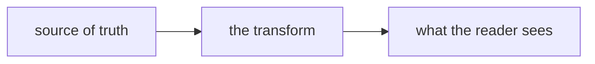

# Subject — what this is, in five words

**What it is:** one sentence a stranger could repeat back correctly.

**What it isn't:** the wrong model a reader would otherwise build. This line does more
work than the other two.

**Why it exists:** the problem that would still be here without it.

Agent-facing version: [`subject.agent.md`](./subject.agent.md). Deeper source:
`path/to/spec`.

## Contents

- [The one rule that shapes everything](#the-one-rule-that-shapes-everything) — read this first or the rest misleads you
- [How it works](#how-it-works) — the mechanism
- [Doing the thing](#doing-the-thing) — the steps, in dependency order
- [When it goes wrong](#when-it-goes-wrong) — failure modes and what they look like
- [Sources](#sources)

---

## The one rule that shapes everything

Open with the claim. The first sentence states the thing; everything after it is why
that's true. If the section's first sentence could be deleted without loss, it was
throat-clearing.

```toml
# Concrete beats general. A real snippet, runnable as written.
[project]
slug = "project-b"
```

---

## How it works

A figure earns its place when it shows something prose is bad at — a topology, a
branching flow, a comparison. Delete this one if the section doesn't have that.



Three or more parallel things with the same attributes belong in a table:

| Thing | What it does | Fails when |
|---|---|---|
| `first` | one line | the thing it depends on isn't there |
| `second` | one line | it's run twice |

---

## Doing the thing

Numbered only when the order is load-bearing.

1. The step, as an imperative. `the-exact-command --with-flags`
2. The next step. Say what a correct result looks like — "prints three rows, all
   `ok`" — so the reader knows whether to continue.

> [!WARNING]
> The trap that costs real money or a rebuild. Three of these per document at most,
> or none of them get read.

---

## When it goes wrong

Every procedure has failure modes, and they're the part worth writing down. Symptom
first, because that's what the reader arrives with.

**Symptom.** What they'll actually see — the error text, the empty list, the silence.
**Cause.** Why. **Fix.** The command or the decision.

---

## Sources

- `path/to/file.py` — where the behaviour above is implemented
- Decision `#123` — why it works this way rather than the obvious way
- The vendor console, read on YYYY-MM-DD — prices and layouts move; re-check before
  quoting these
